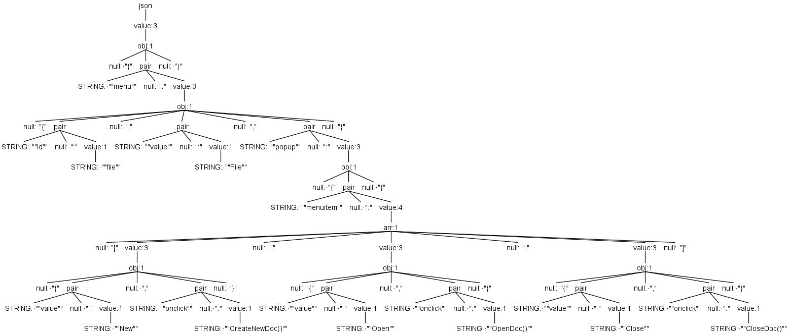

## Parsing with ANTLR4
## Parsica
[Parsica](https://github.com/mathiasverraes/parsica) is a toolkit to build parsers in PHP. Parsica uses a functional programming style. What I like about that:
* very composable code. Small building blocks can be composed to a bigger whole. FP delivers the promise of OOP: reusable code.
* more declarative style instead of imperative: saying _what_ you want to achieve instead of saying _how_ to achieve it.
* nice way to tentatively explore the language you want to parse with small steps that can be tested.
* educational: to show the concepts of FP and category theory in practice.

What I am missing at the moment is building a parser from a grammar. I want to add that.

## ANTLR
[ANTLR](https://www.antlr.org/) is software to build a parser; it is already a bit longer around. In the current version (4.8) PHP is one of the target languages. You can rather easily build a parser in PHP with it, given you have a grammar. No FP, but some advantages that I like very much:
* define a grammar in EBNF and the parser is automatically built. It builds a lexer and a parser that are used sequentially.
* the parser produces a parse tree. **Processing** that output to a specific application is a **seperate step**! You walk the tree and produce what you want with that.
* there are several grammars publicly available. Op https://github.com/antlr/grammars-v4 you can find about 200 grammars at the moment. They can all be used in different target languages. A parser for it in PHP is built with the proverbial push of a button. But beware: after parsing, you still have to define what you want to do with the parsed output.

## Build the parser from the grammar and parse the input with it
As an example we take a JSON-parser in ANTLR4 we build 2 diffent applications with it: 
* one has a PHP-variable as output (like the current JSON-parser in Parsica).
* and another produces XML from that same parse tree.

To build the parser we feed ANTLR the [JSON-grammar](https://github.com/antlr/grammars-v4/blob/master/json/JSON.g4). If we specify PHP as target language, that parser is built in PHP. We can easily do that in PHPstorm by using the [JetBrains ANTLR4-plugin](https://blog.dgunia.de/2017/10/26/creating-and-testing-an-antlr-parser-with-intellij-idea-or-android-studio/). Using the [PHP-runtime library for ANTLR](https://github.com/antlr/antlr-php-runtime), we can parse JSON with that parser and process the produced parse tree.

I took this JSON-object as an example:
~~~
{"menu": {
  "id": "file",
  "value": "File",
  "somenumber": 2,
  "popup": {
    "menuitem": [
      {"value": "New", "onclick": "CreateNewDoc()"},
      {"value": "Open", "onclick": "OpenDoc()"},
      {"value": "Close", "onclick": "CloseDoc()"}
    ]
  }
}}
~~~
And the parser produced this parse tree:

## Walk the tree with a listener or a visitor to build the application
In order to generate an application we have to walk the produced parse tree. ANTLR has two ways to do that: do a tree-walk and then "listen" on which node we are. Each node triggers some output in the listener. The other way is to use a visitor-pattern; each visit of a node triggers the visitor what nodes to visit next. ANTLR produces both a base listener and a base visitor, with methods based on the used grammar. You can extend that listener or visitor to build your own specific application.

In this example I built 2 visitors: 
* one that produces a PHP-variable from the JSON-input.
* and another that produces XML.
Both use the same parser!

JSONvisitor2PHP.php:
~~~
/**
 * Class JSONvisitor2PHP
 * A visitor of the parse-tree that creates PHP
 * given a JSON-string, parsed with json.g4 grammar
 *
 */
final class JSONvisitor2PHP extends JSONBaseVisitor
{
    /**
     * Visits an Object-node in the parse-tree
     *
     * @param Context\ObjContext $context
     * @return StdClass          $object    a php object with key-value pairs
     *
     */
    public function visitObj(Context\ObjContext $context)
    {
        $object = [];
        foreach($context->PAIR() as $pair)
        {
            $object[$this->stripQuotes($pair->STRING())] = $this->visit($pair->VALUE());
        }

        return (object)$object;
    }

    /**
     * Visits an Array-node in the parse-tree
     *
     * @param Context\ArrContext $context
     * @return array             $array    a php array
     *
     */
    public function visitArr(Context\ArrContext $context)
    {
        $array = [];
        foreach($context->VALUE() as $value)
        {
            $array[] = $this->visit($value);
        }

        return $array;
    }

    /**
     * Visits an Value-node in the parse-tree
     *
     * @param Context\ValueContext $context
     * @return STRING | NUMBER | true | false | null | object | array
     *
     */
    public function visitValue(Context\ValueContext $context)
    {
        if($context->STRING())
        {
            return $this->stripQuotes($context->STRING());
        }

        if($context->NUMBER())
        {
            return $context->NUMBER();
        }

        if($context->getText()=='true' ||$context->getText()=='false'  ||$context->getText()=='null')
        {
             return filter_var($context->getText(),
                            FILTER_VALIDATE_BOOLEAN, FILTER_NULL_ON_FAILURE);
        }

        // else the value is an array or object
        return $this->visitChildren($context); // VALUE has only 1 child!
    }

    /**
     * Trim first and last double quotes off from string
     * @param $string
     * @return string without quotes
     */
    private function stripQuotes($string)
    {
        return trim($string, '"');
    }

}
~~~

JSONvisitor2XML.php:
~~~
/**
 * Class JSONvisitor2XML
 * A visitor that creates XML given a JSON-string, parsed with json.g4 grammar
 *
 */
final class JSONvisitor2XML extends JSONBaseVisitor
{

    /**
     * A DOMDocument that is reusable in the whole class, so we don't have to import the created nodes
     * @var DOMDocument
     */
    private $xml;

    /**
     * Visits the root-node in the JSON parse-tree
     *
     * @param Context\JsonContext $context
     * @return DOMDocument        $this->xml   a php DOMDocument with the XML
     *
     */

    public function visitJson(Context\JsonContext $context)
    {
        $this->xml = new DOMDocument();

        $tree = $this->visitChildren($context);
        $this->appendChildren($this->xml, $tree); // leave out the outer <object> tag

        return $this->xml;
    }

    /**
     * Visits an Object-node in the parse-tree
     *
     * @param Context\ObjContext $context
     * @return DOMNode           $this->xml   a php DOMNode with the object pairs in XML
     *
     */
    public function visitObj(Context\ObjContext $context)
    {
        $objectNode = $this->xml->createElement('object');
        foreach($context->PAIR() as $pairContext)
        {
            $pairNode = $this->xml->createElement($this->stripQuotes($pairContext->STRING()));
            $this->setValue($pairNode, $this->visit($pairContext->VALUE()));
            $objectNode->appendChild($pairNode);
        }

        return $objectNode;
    }

    /**
     * Visits an Array-node in the parse-tree
     *
     * @param Context\ArrContext $context
     * @return DOMNode           $this->xml   a php DOMDNode with the array-elements in XML
     *
     */
    public function visitArr(Context\ArrContext $context)
    {
        $node = $this->xml->createElement('array');
        foreach($context->VALUE() as $valueContext)
        {
            $valueNode = $this->xml->createElement('element');
            $this->setValue($valueNode, $this->visit($valueContext));

            $node->appendChild($valueNode);
        }

        return $node;
    }

    /**
     * Visits an Value-node in the parse-tree
     *
     * @param Context\ValueContext $context
     * @return DOMNode                       a php DOMNode with the value in XML
     * if STRING | NUMBER | true | false | null  then wrapped in a <value> tag
     *
     */
    public function visitValue(Context\ValueContext $context)
    {
        if($context->STRING())
        {
            // todo: we probably need some escape for string-values in XML
            return $this->wrapValue($this->stripQuotes($context->STRING()));
        }

        if($context->NUMBER())
        {
            return $this->wrapValue($context->NUMBER());
        }

        if($context->getText()=='true' ||$context->getText()=='false'  ||$context->getText()=='null')
        {
            return $this->wrapValue($context->getText());
        }

        // else the value is an array or object
        return $this->visitChildren($context); // VALUE has only 1 child! Here: object | array
    }

    /**
     * Wrap a bare value in an XML value-tag to create a DOMnode
     * @param  $value
     * @return DOMNode   $valueNode   a php DOMNode (tag: value) with the value in XML
     */
    private function wrapValue($value)
    {
        $valueNode = $this->xml->createElement('value', $value);
        return $valueNode;
    }

    /**
     * Trim first and last double quotes off from string
     * @param $string
     * @return string without quotes
     */
    private function stripQuotes($string)
    {
        return trim($string, '"');
    }

    /**
     * Append all children of $copyFromNode to $newParentNode
     * Both nodes are in the same DOMDocument
     *
     * @param  DOMNode   $newParentNode a php DOMNode where we want to append the children to
     * @param  DOMNode   $copyFromNode  a php DOMNode with the children
     * @return DOMNode   $newParentNode a php DOMNode with the children appended
     */
    private function appendChildren($newParentNode, $copyFromNode)
    {
        // Append all children of $copyFromNode to $newParentNode

        // unfortunately we first have to put those childnodes in an array
        // also see https://dzone.com/articles/renaming-domnode-php  for using firstChild repeatedly
        $children = [];
        foreach ($copyFromNode->childNodes as $child) {
            $children[] = $child;
        }
        foreach ($children as $memberOrElement)
        {
            $newParentNode->appendChild($memberOrElement);
        }
    }

    /**
     * Sets the $value as value in the $containerNode
     * Adds an attribute 'type' in the containerNode, type = object | array | value
     *
     * @param  DOMElement $containerNode
     * @param  DOMNode    $value
     * @return void
     */
    private function setValue(DOMElement $containerNode, $value): void
    {
        $type = $value->tagName; // type = object | array | value
        $containerNode->setAttribute("type", $type);

        // type == value => a bare value, a terminal; otherwise: children of object or array
        if ($type == 'value')
        {
            $containerNode->nodeValue = $value->nodeValue;
        }
        else
        {
            // Append children of $value (= all members of an object or all elements of an array)
            $this->appendChildren($containerNode, $value);
        }
    }

}
~~~
Length of that code is more due to how DOMDocument works than because of  ANTLR. The code for the visited nodes (the public methods) is relatively simple.

This is the produced XML:
~~~
<menu type="object">
    <id type="value">file</id>
    <value type="value">File</value>
    <somenumber type="value">2</somenumber>
    <popup type="object">
        <menuitem type="array">
            <element type="object">
                <value type="value">New</value>
                <onclick type="value">CreateNewDoc()</onclick>
            </element>
            <element type="object">
                <value type="value">Open</value>
                <onclick type="value">OpenDoc()</onclick>
            </element>
            <element type="object">
                <value type="value">Close</value>
                <onclick type="value">CloseDoc()</onclick>
            </element>
        </menuitem>
    </popup>
</menu>

~~~

Running the generated lexer & parser and the 2 visitors:
~~~
use Antlr\Antlr4\Runtime\CommonTokenStream;
use Antlr\Antlr4\Runtime\Error\Listeners\DiagnosticErrorListener;
use Antlr\Antlr4\Runtime\InputStream;

// Read file, whose name is parameter at the CLI
$input = InputStream::fromPath($argv[1]); 

$lexer = new JSONLexer($input);
$tokens = new CommonTokenStream($lexer);
$parser = new JSONParser($tokens);
$parser->addErrorListener(new DiagnosticErrorListener());
$parser->setBuildParseTree(true);

// json() is the root-node of the parse-tree
$tree = $parser->json(); 

// PHP-variable as output from this parse tree
$JSONvisitor2PHP = new JSONvisitor2PHP();
$result = $JSONvisitor2PHP->visit($tree);

// XML-output from this parse tree
$JSONvisitor2XML = new JSONvisitor2XML();
$xml = $JSONvisitor2XML->visit($tree);

// Show the XML
echo $xml->saveXML();
~~~

## From grammar to Parsica parser
In my project to automatically build a parser in Parsica from a given grammar, i've com to the following conclusions based on working with ANTLR:
* use the EBNF-variant that is used in ANTLR, so grammars can be shared.
* investigate splitting in a lexer and a parser. 
* output of the parser will be a parse tree. Provide a base listener and/or visitor to walk that tree, to build custom applications with the parsed text.

## More about ANTLR
In the text I referred to the IntelliJ-ANTLR-plugin (to use in PHPstorm) and the PHP-ANTLR-runtime (to add via Composer). Some more resources:
* Federico Tomassetti: The ANTLR Mega Tutorial https://tomassetti.me/antlr-mega-tutorial/ 
* Terence Parr: The Definitive ANTLR 4 Reference https://pragprog.com/titles/tpantlr2/the-definitive-antlr-4-reference/
* code and documentation: https://github.com/antlr/antlr4
* ANTLR 4 Runtime 4.8 API https://www.antlr.org/api/Java/
* download ANTLR: https://www.antlr.org/download.html 

I'll make a seperate repository with ANTLR-examples in PHP.

Herman Peeren, September 8, 2020